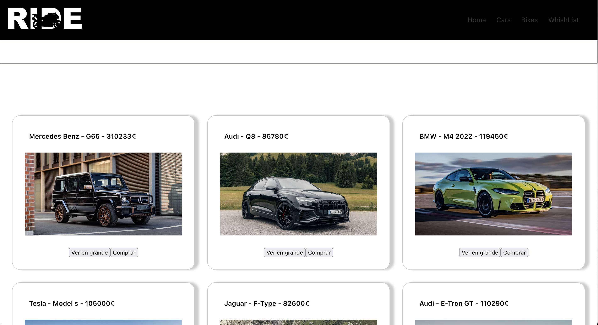

# Nombre de tu proyecto

CarsAndBikes

## Tabla de contenidos

- [Descripción](#descripción)
- [Características](#características)
- [Capturas de pantalla](#capturas-de-pantalla)
- [Instalación](#instalación)
- [Licencia](#licencia)

## Descripción

CarsAndBikes es tu web para comprar los coches y motos más exclusivos del mercado

## Características

- Busqueda de los coches y motos del catálogo.
- Página con noticias sobre los nuevos vehículos que llegan al mercado con sistema de subscripción para que no te pierdas ninguna noticia.
- Página para que eligas el coche que te gustaría que añadieramos a la web.

## Capturas de pantalla




## Instalación

- Instalamos de manera global create-react-app

```
npm install -g create-react-app
```

- Ahora creamos nuestro proyecto y le ponemos nombre.

```
create-react-app nombre-de-tu-proyecto
```

- Luego entras a la carpeta de tu proyecto

```
cd nombre-de-tu-proyecto
```

- Ahora inicias el proyecto y levantas el servidor

```
npm start
```

## Entendiendo la estructura de carpetas


- **Carpeta Public**

Ahi se encuentra nuestro archivo index.html que es el que se mostrará en el navegador.
En su interior solo tiene un div con el id 'root'

```html
<div id="root"></div>
```


- **Carpeta src**

Empieza con toda la estructura del proyecto
empieza con el archivo `index.js`


Y lo que debes entender es:

- `import` : se usa para importar funciones que han sido exportadas desde un módulo externo.


*Mira el archivo index.js*

```code en el archivo index.js
import App from './App';
```


- `export` : La declaración export es usada para exportar funciones, objetos o tipos de dato primitivos a partir de un archivo (o módulo). 

*Mira el archivo App.js*

```code
export default App;

```

## Archivos de src

- `index.js` : Es el corazón del proyecto, se encuentran importados todos los recursos.

- `index.css` : Es el css general de la aplicación.

- `App.js` : Componente app de react

- `App.css`: Es el css que se va a aplicar al componente App de React.

Recuerda cada componente maneja su propio CSS

## Licencia

Licencia codigo abierto.

---

